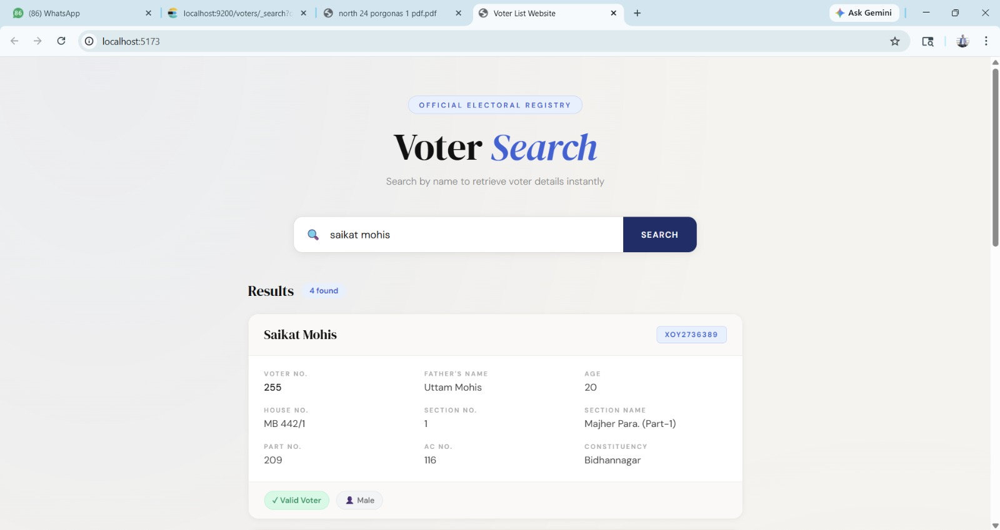
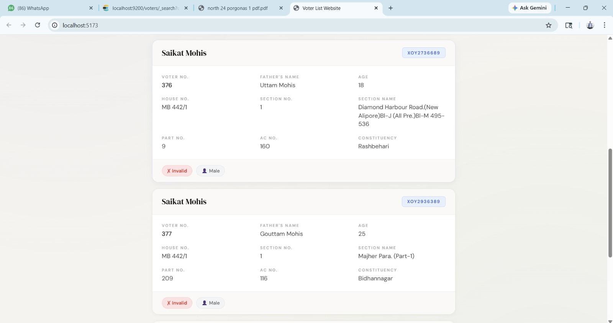
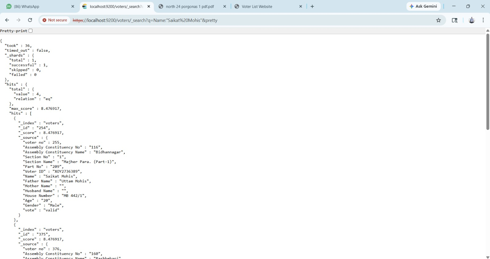

# Voter Data Search System

A full-stack system to **extract, structure, and search voter data** efficiently using OCR + Elasticsearch + React.

---

## Overview

This project solves a real-world problem:

> Voter data is released as **scanned PDFs (unstructured, noisy)**. 
> After SIR, voter list changes and people want to know about their own information and their neighbour information fast.

So me and my frined build and developed a searchable voter information platform that helps users quickly verify their voter details after **SIR 2026** updates for our local booth.

The system allows users to:
-  Search voter details by **Name or Voter ID**
-  Verify if a voter is **Valid / Deleted**
-  View constituency, section, and part details instantly
-  Experience fast search powered by **Elasticsearch**

---

## Core Idea

The challenge for the execution of the project was **data preparation for elastic search**.

Election data came as:
- Scanned PDFs
- Semi-structured layout
- OCR noise and inconsistencies

We used a Mixture of Experts (MoE) based optical charecter recognistion (OCR) system.
---

## Screenshots

Below Screenshot of our system wokring on our local machine.

### Home Page

---

### Search Results UI

---

### Raw Elasticsearch Response

---

## Dataset Details

  - 1,50,000+ voter records indexed
  - Structured by:
  - District
  - Assembly Constituency
  - Section / Part

### Searchable Fields:
- Name
- Voter ID
- Age
- Gender
- House Number
- Father / Mother / Husband Name
- Assembly Constituency
- Section / Part Number
- Voting Status (Valid / Deleted)

---

## Tech Stack

### Backend / Data Layer
- **Elasticsearch** — fast full-text search engine
- **JSON Data Pipeline** — structured indexing

### Data Extraction
- **MoE-based OCR Model**
  - Extracts structured text from scanned PDFs
  - Handles noisy and inconsistent layouts

### Frontend
- **React.js**
  - Clean UI for search and display
  - Query-based search requests to Elasticsearch

---

## How Search Works (Important Concept)

Instead of traditional DB queries:

- We send a query like:

- Elasticsearch:
  - Tokenizes text
  - Matches approximate terms
  - Ranks results using relevance scoring

That’s makes search feels **fast and flexible**, even with messy real-world data.

---

## Data Processing Challenges

### 1. OCR Noise
- Misread characters (e.g., `0` vs `O`)
- Broken names / spacing issues

### 2. Semi-Structured Layout
- Data not in fixed format
- Required custom parsing logic

### 3. Cleaning & Normalization
- Standardizing names
- Handling missing fields
- Structuring into consistent JSON

---

## Future Improvements Plan

- Fuzzy search tuning (better typo handling)
- Advanced filtering (age, constituency, etc.)
- Deployment on cloud 
- API layer instead of direct ES queries
- Better OCR accuracy with fine-tuned models

---

## Conclusion

This project demonstrates how unstructured, scanned voter lists can be transformed into a fast, searchable information system using OCR, data processing, and Elasticsearch. By indexing over 1.5 lakh voter records, we enabled instant voter verification after the SIR 2026 update. The system was successfully deployed at a local internet café, where it helped 150+ citizens quickly access and verify their voter information before the election, proving its practical value in real-world public service.

---